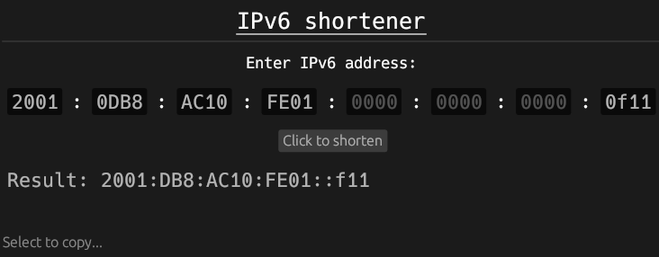

# IPv6-shortener

A simple GUI application used for shortening IPv6 addresses.

This is a school project where main tasks are creating a **user friendly GUI** and having **functionality**.

## How to run

You can just download the '.exe' from [this page](https://github.com/Blatko1/IPv6-shortener-GUI/releases/tag/v1.0) and run it or you can clone the repo and build it manually.